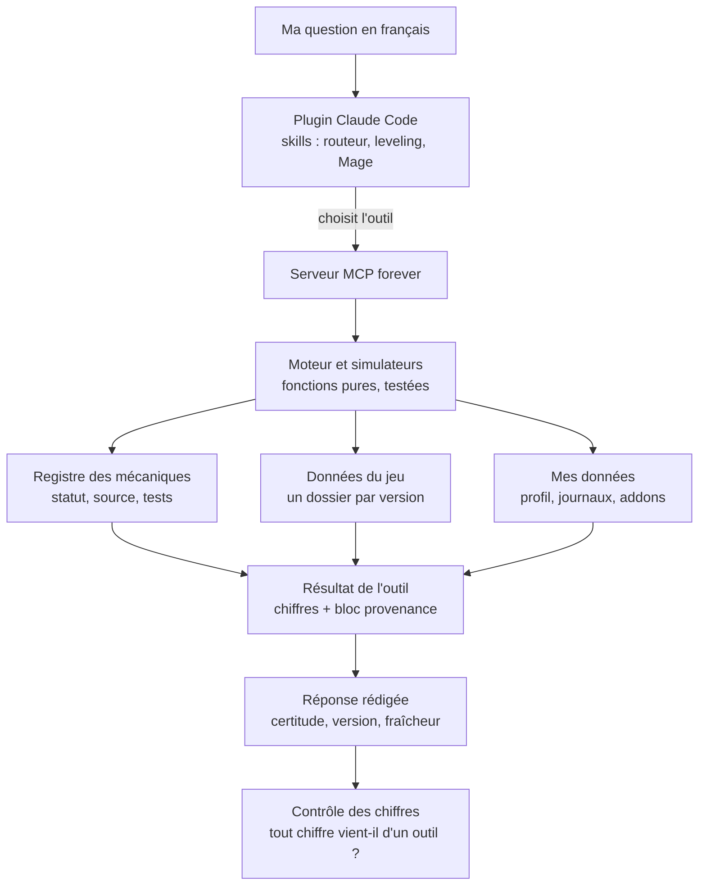

# WoW Forever — système expert

Un assistant qui **calcule** les réponses aux questions sur *World of Warcraft: Forever* au lieu de les deviner.
On pose sa question en français, dans Claude Code ; la réponse arrive avec ses chiffres, la version du jeu d'où ils
viennent et le degré de confiance qu'on peut leur accorder.

---

## 1. Ce que c'est

Forever est une nouvelle version de World of Warcraft : les talents, les sorts et les monstres n'y sont pas ceux de
Classic, et les guides écrits ailleurs y sont souvent faux. Un modèle de langage interrogé de mémoire répond avec
assurance des chiffres inventés ou périmés.

Ce projet prend le problème dans l'autre sens : **les chiffres sont lus dans les fichiers du client du jeu et
calculés par un moteur testé**. L'IA ne sert qu'à comprendre la question, appeler le bon outil et rédiger la réponse.

### Exemples de questions

| Sujet | Question |
|---|---|
| Talent | « Que fait Improved Frostbolt au rang 3 ? », « Quel talent prendre au prochain niveau ? » |
| Build | « Meilleur build de leveling à mon niveau ? », « Givre ou Feu en donjon ? » |
| Respec | « J'ai tout mis en Feu, faut-il respec maintenant ? » |
| Leveling | « Combien de temps pour tuer un monstre en Givre ? », « Combien d'XP par heure ? » |
| Zone | « Où aller à mon niveau côté Horde ? » |
| Mécanique | « Comment marche Ignite ? », « Hot Streak se cumule comment ? » |
| Données | « Mes données sont-elles à jour ? », « Qu'est-ce qui a changé depuis la dernière version ? » |

### Ce qui est couvert aujourd'hui

Le Mage : sorts, talents, mécaniques de combat, simulateur de leveling (temps par monstre, XP par heure), builds
optimisés par contexte (leveling, donjon, raid, PvP) avec l'ordre des talents et le conseil de respec ; les zones et
donjons adaptés à un niveau ; la fraîcheur des données et ce qui change d'une version du jeu à l'autre ; un profil de
personnage pour que les réponses partent du bon niveau et des bons talents.

### Ce qui arrive

Le PvP, l'analyse de mes propres combats, les huit autres classes, les donjons et leur butin, le Legacy, les métiers,
les réputations, l'équipement, le raid. Sur ces sujets, l'assistant répond aujourd'hui « je ne sais pas » et cite la
tranche qui les couvrira.

La liste exacte, avec sa correspondance dans la feuille de route :
[docs/USAGE.md](docs/USAGE.md#ce-que-le-plugin-ne-sait-pas-encore), section « Ce que le plugin ne sait pas encore ».
L'ordre des travaux : [docs/ROADMAP.md](docs/ROADMAP.md). L'état des données à un instant donné : `uv run forever
status`.

---

## 2. Comment ça marche

### Le parcours d'une question



### L'IA ne calcule jamais

C'est la règle qui tient tout le reste. Le modèle n'a le droit ni d'additionner, ni de multiplier, ni d'appliquer une
formule à la main : **chaque chiffre d'une réponse est recopié tel quel d'un résultat d'outil**. S'il manque une
valeur, il appelle un autre outil ou dit qu'elle manque.

Deux garde-fous rendent la règle vérifiable :

- **Le dépôt ne contient aucun chiffre de jeu hors de `forever/data/`** — ni dans un skill, ni dans un prompt, ni dans
  un commentaire. Un contrôle automatique le vérifie à chaque validation.
- **Un contrôle des chiffres** relit chaque réponse à la fin : tout nombre suivi d'une unité de jeu qui ne figure dans
  aucun résultat d'outil de la session est signalé par un message `[forever:chiffres]`. Il ne bloque rien, il prévient.

### Certitude et provenance

Chaque résultat d'outil porte un bloc `provenance` : version du jeu, empreinte des données, date, fraîcheur,
hypothèses, et une **certitude** :

| Certitude | Ce que ça veut dire |
|---|---|
| `certain` | Lu dans les fichiers du client, ou observé en jeu dans mes journaux |
| `probable` | Calculé par une formule du client, ou recoupé entre deux sources |
| `suppose` | Estimé, hérité de Classic, ou tiré d'un addon, de Wowhead ou d'un guide — à vérifier en jeu |

La réponse se termine par une ligne du même genre : `Certitude : … · Version … · Fraîcheur … (date)`. Une règle du jeu
dont on n'est pas sûr n'est jamais devinée : elle est marquée `suppose`, avec une note, et la question part dans
[docs/OPEN_QUESTIONS.md](docs/OPEN_QUESTIONS.md).

Toute mécanique modélisée a son entrée dans le registre
([docs/MECHANICS_REGISTRY.yaml](docs/MECHANICS_REGISTRY.yaml)) : description, statut, sources et tests qui la
couvrent. `uv run forever status` en donne la couverture du moment.

---

## 3. Installation sur un PC Windows

### Prérequis

- [Git for Windows](https://git-scm.com/download/win) (il fournit aussi le bash dont se servent les hooks) ;
- [uv](https://docs.astral.sh/uv/getting-started/installation/) — il installe Python tout seul, `pip` n'est jamais
  utilisé ;
- [Claude Code](https://claude.com/claude-code) (commande `claude`) ;
- le client de World of Warcraft: Forever installé (facultatif, mais il débloque la lecture de mes journaux de combat
  et de mes addons).

### Installer

```powershell
git clone <adresse du dépôt> wow-forever
cd wow-forever
powershell -ExecutionPolicy Bypass -File scripts\install_plugin.ps1
```

`-ExecutionPolicy Bypass` contourne la politique d'exécution pour ce seul lancement, sans rien changer au réglage de
Windows. Si le client du jeu est ailleurs que dans `Program Files`, ajouter `-WowDir "<dossier du client>"`.

Le script est relançable sans risque. Il pose les variables d'environnement, lance `uv sync`, déclare la marketplace
locale du dépôt, installe le plugin `forever` au niveau utilisateur, puis contrôle que tout répond.

**Ouvrir ensuite un nouveau terminal** : les variables d'environnement n'arrivent que dans les terminaux ouverts
après coup.

### Les trois variables d'environnement

| Variable | À quoi elle sert | Valeur |
|---|---|---|
| `FOREVER_HOME` | Dit au plugin où trouver le dépôt. Le plugin est installé au niveau utilisateur, il faut donc lui indiquer le code. **Sans elle, rien ne répond hors du dépôt.** | Le dossier du clone |
| `FOREVER_WOW_DIR` | Dossier du client du jeu, lu en lecture seule (journaux de combat, addons, sauvegardes) | Par défaut la bêta trouvée sous `Program Files (x86)` ou `Program Files` |
| `FOREVER_PROFILE` | Fichier de mon profil de personnages. Il vit **hors du dépôt** : c'est une donnée personnelle | Par défaut `%USERPROFILE%\.forever\profile.json` |

Les deux premières sont posées par le script d'installation ; la troisième ne se règle que pour déplacer le profil.

### L'addon ForeverLogger

Il relève le niveau et les talents du personnage, et active le journal de combat détaillé. Il s'installe à part :

```powershell
uv run python scripts/install_addon.py
```

Il ne joue jamais à ma place : aucune fonction d'action, aucune lecture d'écran, aucun abonnement au journal de
combat en jeu. Les règles complètes : [docs/ADDON.md](docs/ADDON.md).

### Second PC

La même procédure, à l'identique : cloner, lancer le script, ouvrir un nouveau terminal, installer l'addon. Le profil
des personnages n'est pas dans le dépôt : il se recopie à la main, ou se refait avec `forever profile set`.

### Mettre à jour

```powershell
git pull
powershell -ExecutionPolicy Bypass -File scripts\install_plugin.ps1
```

Puis **redémarrer Claude Code** : un plugin déjà chargé ne se recharge pas tout seul.

---

## 4. Utilisation

### Avec Claude Code

Lancer `claude` dans n'importe quel dossier et poser sa question en français. Le plugin choisit l'outil, la réponse
cite ses sources.

Quelques habitudes utiles :

- La réponse est **courte par défaut** ; demander « détaille » ou « pourquoi » pour les raisons, les hypothèses et les
  alternatives.
- Une question personnelle (« mon Mage », « mon perso ») part du personnage actif du profil et demande ce qui manque ;
  une question générale (« l'arbre optimal du Mage en raid ») annonce l'hypothèse neutre de son calcul.
- Dire « j'ai … » propose une mise à jour du profil.

Le mode d'emploi détaillé — exemples, lecture d'une réponse, gestion du profil : [docs/USAGE.md](docs/USAGE.md).

### Sans IA, en ligne de commande

Toutes les réponses viennent de ces commandes ; on peut les appeler directement. Elles s'exécutent depuis la racine
du dépôt, avec `uv run` (jamais `pip`).

```powershell
uv run forever status                      # version des données, fraîcheur, couverture du registre
uv run forever lookup spell frostbolt      # un sort : rangs, dégâts, coût, temps d'incantation
uv run forever lookup talent "Improved Frostbolt"
uv run forever lookup zones --level 22 --faction horde
uv run forever explain-mechanic A5         # une mécanique : formule, certitude, sources, tests
uv run forever sim leveling --level 24     # temps par monstre, XP par heure
uv run forever build leveling --level 30   # build : talents, ordre, raisons, alternative, respec
uv run forever profile show                # mon personnage actif
uv run forever logs scan                   # mes journaux de combat trouvés sur le disque
uv run forever measures refresh            # remesurer les monstres depuis mes journaux (écrit après accord)
```

Chaque commande accepte `--json` et rend le même bloc `provenance` que l'outil équivalent.

La chaîne de mise à jour des données, quand une nouvelle version du jeu sort :

```powershell
uv run forever builds                      # versions publiées du client
uv run forever fetch --version <version>   # télécharger ses tables (seule étape en réseau)
uv run forever decode --version <version>  # les décoder en version candidate, hors du dépôt
uv run forever diff <ancienne> <nouvelle>  # ce qui change
uv run forever verify <candidate>          # contrôles de cohérence
uv run forever install --new-version       # installer, après lecture du diff
```

Rien ne s'installe tout seul : le diff se lit, puis on décide.

---

## 5. Données

### Hiérarchie des sources

Une source plus haute l'emporte toujours sur une plus basse, et un écart entre deux sources est signalé, jamais
tranché au hasard.

1. **Les fichiers du client du jeu** (tables décodées, correctifs) — `certain`.
2. **Mes observations** : mes journaux de combat, les relevés de ForeverLogger — `certain` pour ce qu'ils mesurent.
3. **Wowhead Forever et les addons de données** (Questie, AtlasLoot, ForeverDungeonJournal…) — `suppose` au mieux.
   Wowhead sert à **contrôler** les valeurs décodées, jamais à les fournir ; une divergence est une alerte, pas un
   arbitrage.
4. **Les guides** (sites, forums, vidéos) — `suppose`, avec leur source et leur date.

Le détail : [docs/DATA_SOURCES.md](docs/DATA_SOURCES.md).

### Une version de données par version du jeu

Chaque version du jeu a son dossier dans `forever/data/`, immuable, avec l'empreinte de chacun de ses fichiers. Une
correction apportée sans changement de version du jeu devient une **révision** du même dossier. Si une empreinte ne
correspond plus, les outils refusent de répondre plutôt que de servir une donnée douteuse.

### Veille automatique

Un workflow quotidien interroge la liste des versions publiées. Quand une nouvelle version sort, il télécharge ses
tables, les décode, les compare à la version installée et ouvre une proposition de mise à jour avec le résumé des
écarts. **Il n'installe jamais rien.**

### Addons lus en local

Les addons de données installés sur le PC sont lus **sur le disque, jamais par le réseau**, et jamais dans les tests.
Leur version accompagne chaque valeur. Seuls des agrégats entrent dans le dépôt, jamais leurs tables.

### Aucune donnée personnelle dans le dépôt

Le profil des personnages, les journaux de combat et les sauvegardes d'addons restent hors du dépôt. Les autres
joueurs qui apparaissent dans un journal sont anonymisés à la lecture. Les rares extraits versionnés sont des
fixtures de test réduites et anonymisées.

---

## 6. Avec d'autres IA

Le serveur MCP est indépendant de Claude Code : n'importe quel client MCP local peut l'appeler.

### Configuration

La même entrée fonctionne pour **Claude Desktop**, **Codex CLI**, **Gemini CLI** et **Cursor** — seul l'emplacement du
fichier de configuration change (respectivement `claude_desktop_config.json`, `~/.codex/config.toml`,
`~/.gemini/settings.json` et `.cursor/mcp.json`) :

```json
{
  "mcpServers": {
    "forever": {
      "command": "uv",
      "args": ["run", "--directory", "C:\\Users\\moi\\Documents\\wow-forever", "forever", "mcp"]
    }
  }
}
```

Remplacer le chemin par celui du clone. Codex CLI attend la même chose en TOML :

```toml
[mcp_servers.forever]
command = "uv"
args = ["run", "--directory", "C:\\Users\\moi\\Documents\\wow-forever", "forever", "mcp"]
```

Le serveur annonce lui-même ses règles au client (aucun chiffre sans appel d'outil, certitude et provenance
affichées, ce qui n'est pas couvert annoncé) : un client MCP correct les transmet au modèle.

**Sur le web** (claude.ai, ChatGPT), il faudra un serveur MCP distant : c'est la tranche T13, pas encore faite.

### Ce qu'on perd hors de Claude Code

Les outils et leurs chiffres restent les mêmes, mais deux couches disparaissent :

- **Les skills** — le routeur qui choisit l'outil, impose le format de réponse et sait dire ce qui n'est pas encore
  couvert. Sans lui, le modèle aiguille moins bien et répond plus volontiers de mémoire sur les sujets non couverts.
- **Le contrôle des chiffres** — le hook qui relit la réponse et signale un chiffre qui ne vient d'aucun outil.

Autrement dit : hors de Claude Code, les réponses sont justes quand le modèle appelle les outils, mais plus rien ne
vérifie qu'il l'a fait.

---

## 7. Dépannage

| Symptôme | Cause et remède |
|---|---|
| Le plugin ne tient pas compte d'une mise à jour | **Redémarrer Claude Code.** Un plugin déjà chargé garde sa version en mémoire ; après `git pull` + script d'installation, il faut une nouvelle session. |
| « Le serveur forever ne répond pas » | `FOREVER_HOME` est absent ou faux (le dépôt a été déplacé ou renommé). Relancer `scripts\install_plugin.ps1` **depuis le dépôt**, puis ouvrir un nouveau terminal. Vérifier avec `echo $env:FOREVER_HOME`. |
| Rien ne répond hors du dépôt, tout marche dedans | Même cause : sans `FOREVER_HOME`, le plugin ne retrouve le code que lorsqu'il est chargé sur place. |
| Fraîcheur `stale` | Une version du jeu plus récente que les données locales est publiée. Les réponses restent données, étiquetées, avec une certitude abaissée sur ce qui a changé. Lancer la chaîne de mise à jour (section 4) ; rien ne s'installe sans validation. |
| Fraîcheur `unknown` ou `silent` | `unknown` : pas de réseau et pas de cache utilisable — le dernier état connu est affiché avec son âge. `silent` : aucune nouvelle version depuis deux semaines, possible changement de produit. |
| L'addon n'apparaît pas en jeu | Vérifier que `<client>\Interface\AddOns\ForeverLogger\ForeverLogger.toc` existe, que l'addon est coché à l'écran de sélection des personnages, et relancer `uv run python scripts/install_addon.py` si besoin (`--dry-run` montre ce qu'il ferait sans rien écrire). |
| Les mesures ne bougent pas après une session de jeu | Une mesure n'est retenue que si le journal a été écrit sous la version du jeu installée ; les autres sont listées « en attente ». |

---

## 8. Structure du dépôt

```
forever/        cœur Python : données versionnées, moteur, simulateurs, optimiseurs, CLI, serveur MCP
plugin/         plugin Claude Code : skills, sous-agents, hooks, jeu d'évaluation — aucun calcul, aucun chiffre
addon/          ForeverLogger, l'addon du jeu (lecture seule, aucune action)
scripts/        installation, contrôles, extraction de fixtures
tests/          unitaires, intégration, parité, golden, fixtures
docs/           spécification, architecture, feuille de route, décisions, sources, registre des mécaniques
tasks/          plans et notes de chaque tranche de travail
seed/           code de référence validé, à porter (lecture seule)
```

| Document | Contenu |
|---|---|
| [docs/SPEC.md](docs/SPEC.md) | Ce que le système doit savoir faire, et pour qui |
| [docs/ARCHITECTURE.md](docs/ARCHITECTURE.md) | Comment c'est construit, couche par couche |
| [docs/ROADMAP.md](docs/ROADMAP.md) | Les tranches de travail, dans l'ordre |
| [docs/DECISIONS.md](docs/DECISIONS.md) | Chaque choix, sa raison, et ce qui a été écarté |
| [docs/USAGE.md](docs/USAGE.md) | Mode d'emploi du plugin, au jour le jour |
| [docs/DEVELOPMENT.md](docs/DEVELOPMENT.md) | Comment ce projet se développe (méthode, rôles, cycle d'une tranche) |
| [docs/DATA_SOURCES.md](docs/DATA_SOURCES.md) | D'où vient chaque donnée, et ce qui manque encore |
| [docs/ADDON.md](docs/ADDON.md) | Règles de l'addon en jeu |
| [CLAUDE.md](CLAUDE.md) | Les invariants que l'agent doit respecter en permanence |
